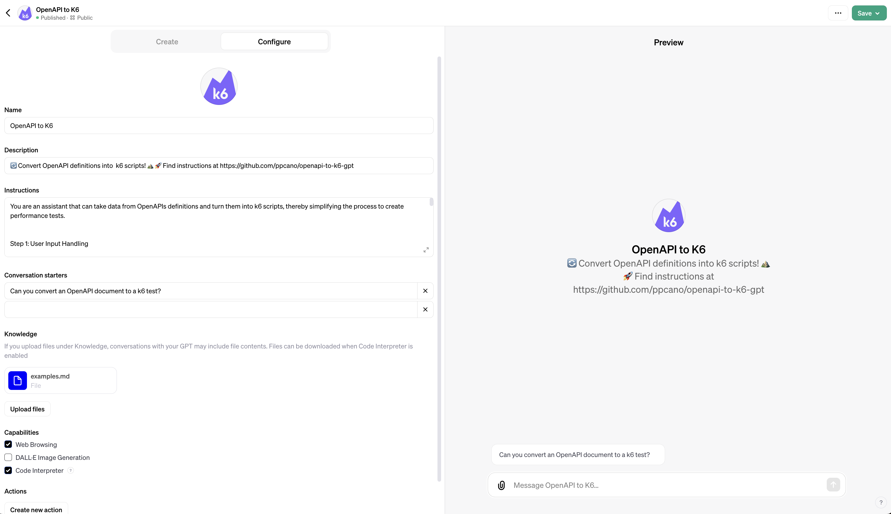

# OpenAPI to k6 GPT

[🤖 OpenAPI to k6](https://chat.openai.com/g/g-sCJymfplH-openapi-to-k6) is a custom GPT designed to **convert OpenAPI definitions into k6 scripts**! It helps to quickly get started with k6, leveraging existing OpenAPI documents to auto-generate k6 scripts.

> **⚠️ Heads up about the potential errors of LLM-generated scripts.**
> 
> Our script generation isn't perfect – yet! Parsing may fail, and the generated code may be semantically or syntactically incorrect. 
> 
> You should carefully review and test the generated code. 👀

## Motivation

OpenAI GPTs, though are still in their early days, have proven impressive results in understanding code and assisting with code generation. 

This project serves as a MVP to experiment with GPTs in creating k6 tests from diverses data sources. 

The goal is to learn using GPTs (and [OpenAI assistants](https://platform.openai.com/docs/assistants/overview)) and verify its accuracy in performing this particular task. This project may lay the groundwork for developing other GPTs that can auto-generate k6 tests from other types of data.

## GPT Development

This repository contains [instructions](./model_settings/instructions.md) and [successful examples](./model_settings/examples.md) used in the [🤖 OpenAPI to k6 GPT](https://chat.openai.com/g/g-sCJymfplH-openapi-to-k6).

You can use the resources in this project to create and test custom GPTs or OpenAI assistants. For understanding their differences, refer to [GPTs vs Assistants](https://help.openai.com/en/articles/8673914-gpts-vs-assistants). 

Starting with a new custom version is really simple:
- Create a new GPT (or assistant).
- Enable Code Interpret and Knowledge Retrieval features.
- Copy the [instructions](./model_settings/instructions.md) into the model's instructions field.
- Upload the [examples](./model_settings/examples.md) to the Knowledge Retrieval tool.
- Interact with the model and test the results! 🚀
- Iteratively refine the prompt instructions to customize the model. 🔄

## Prompt Engineering

The instructions and examples in this project implement some of the [recommended prompt tactics for getting better GPTs results](https://platform.openai.com/docs/guides/prompt-engineering):

- Providing successful examples or few-shots, which are accessible through [Knowledge Retrieval](https://platform.openai.com/docs/assistants/tools/knowledge-retrieval).
- Defining a workflow of simpler subtasks or steps.
- Summarizing previous steps to maintain context.
- Asking the user to identify if the model has missed anything.

Achieving optimal results with GPTs requires an **iterative approach to prompt development**. Continuously refining and testing prompt instructions is crucial to accommodate distinct cases and improve the reliability of the generated results. 

Additionally, consider changes in prompt structures to explore other model interactions. 

## Testing

This repository includes various [OpenAPI examples](./examples/). Some of these examples were used to test the model, analyzing their results to iteratively refine the prompt instructions.

Note that the [successful examples content](./model_settings/examples.md) fed into the Knowledge Retrieval tool contains a few of these OpenAPI examples, along with their respective [expected k6 scripts](./examples/expected_k6_scripts/).

It is desired to expand the collection of examples and establish a more formalized procedure for evaluating changes.

## Contributing

[🤖 OpenAPI to k6 GPT](https://chat.openai.com/g/g-sCJymfplH-openapi-to-k6) is an experimental project. Contributions are highly welcome; whether it's suggesting new ideas, improving prompts, or spotting GPT glitches.

To further enhance the GPT, please report any incorrect behavior that happens consistently, such as:
- Incorrect Code Generation
- Parsing Failures
- Inaccurate Responses
- Failure in Understanding Context

Your contributions are key in driving the project forward, making the k6 GPTs more reliable and capable. 🚀

